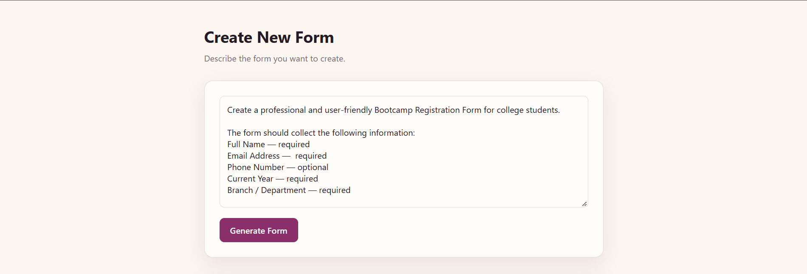
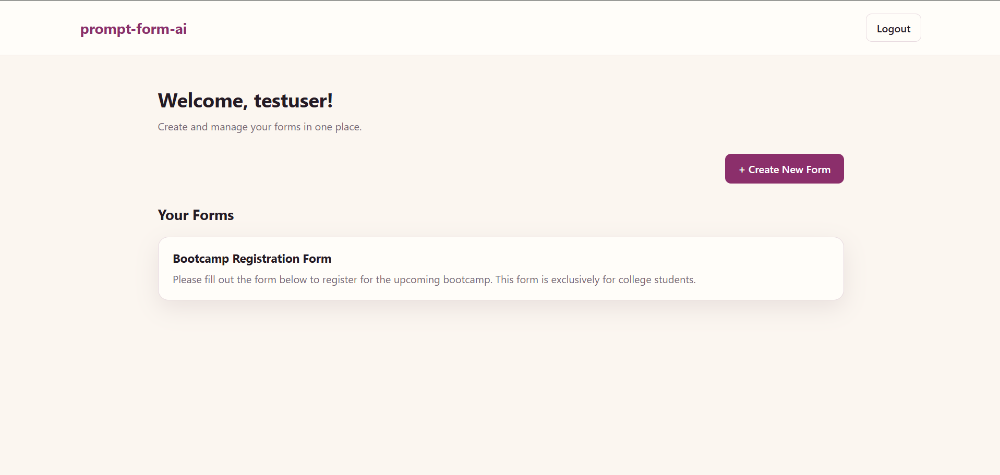
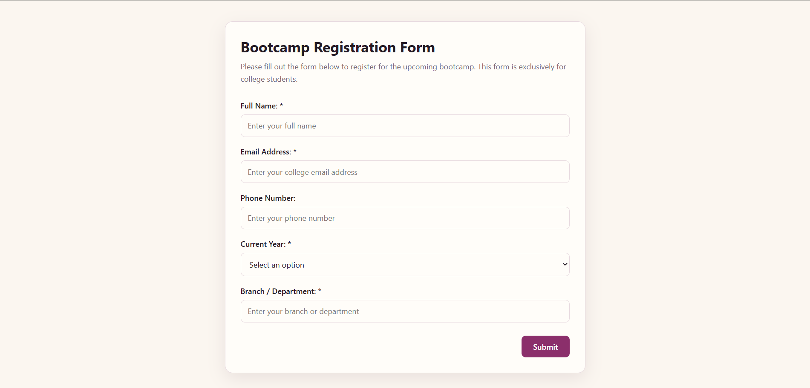
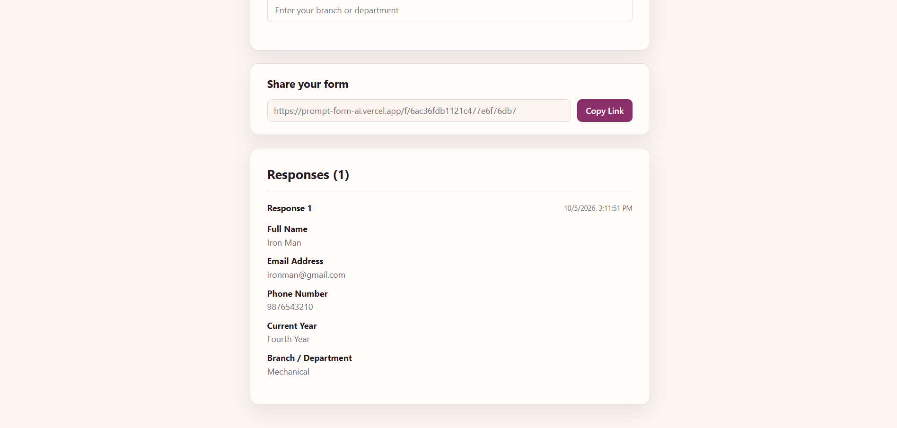

# 🤖 prompt-form-ai

> An AI-powered form builder that turns natural-language prompts into customizable forms using Google Gemini.

**Live Demo:** https://prompt-form-ai.vercel.app

---

## ✨ Features

### 🤖 AI Form Generation

Describe the form you want using natural language, and Gemini generates a structured form automatically.

Example:

```text
Create a customer feedback form with name, email,
rating from 1 to 5, and comments.
```

The generated form can then be reviewed and edited before saving.

### ✏️ Form Customization

Users can review and customize AI-generated forms before saving them.

- Edit generated field labels
- Preview the generated form
- Support multiple field types:
  - Text
  - Textarea
  - Email
  - Number
  - Telephone
  - URL
  - Date
  - Time
  - Date & Time
  - Select
  - Radio
  - Color

### 🔐 Authentication

- User registration and login
- Password hashing with `bcryptjs`
- JWT-based authentication
- Protected user routes
- Each user can access only their own forms and responses

### 💾 Form Management

- Save generated forms to MongoDB
- View saved forms from the dashboard
- Open individual saved forms
- Preview saved forms

### 🔗 Public Form Sharing

Every saved form gets a shareable public URL.

Public respondents do not need an account to access or submit a form.

### 📝 Response Collection

- Submit responses through public forms
- Validate submitted fields on the frontend
- Store responses in MongoDB
- View responses from the form owner's page
- Display the number of responses

---

## 🖼️ Screenshots

### 🤖 AI Form Generation

Generate a form from a natural-language prompt using Google Gemini.



### 📊 Dashboard

View and manage saved forms from the authenticated dashboard.



### 🌐 Public Form

Share forms using a public URL that does not require respondents to create an account.



### 📝 Form Responses

Form owners can view responses submitted through their public forms.



---

## 🧠 Technical Highlights

- 🏗️ Built a full-stack MERN application with separate React/Vite and Node/Express applications.
- 🤖 Integrated Google Gemini to generate structured form schemas from natural-language prompts.
- 🔐 Implemented JWT-based authentication with `bcryptjs` password hashing.
- 👤 Implemented backend ownership checks so users can only access their own forms and responses.
- 🌐 Built public, unauthenticated form pages while keeping owner data protected.
- 🗄️ Designed MongoDB/Mongoose models for users, forms, and responses.
- 🔄 Built REST APIs for authentication, AI form generation, form management, and response collection.
- ⚡ Added loading states for asynchronous operations across the application.
- 🚀 Deployed the frontend on Vercel and the backend on Render.

---

## 🛠️ Tech Stack

### Frontend

- React
- Vite
- React Router
- JavaScript
- Native Fetch API
- `js-cookie`
- `react-loader-spinner`
- Plain CSS

### Backend

- Node.js
- Express
- MongoDB
- Mongoose
- JWT
- `bcryptjs`
- CORS
- dotenv

### AI

- Google Gemini API
- `@google/genai`

### Deployment

- ☁️ Vercel — Frontend
- 🚀 Render — Backend
- 🍃 MongoDB Atlas — Database

---

## Application Architecture

```text
                         👤 User
                           │
                           ▼
                  ┌─────────────────┐
                  │  React + Vite   │
                  │     Vercel      │
                  └────────┬────────┘
                           │
                     HTTP / Fetch
                           │
                           ▼
                  ┌─────────────────┐
                  │ Node + Express  │
                  │     Render      │
                  └───────┬─┬───────┘
                          │ │
              ┌───────────┘ └───────────┐
              ▼                         ▼
     ┌─────────────────┐       ┌─────────────────┐
     │  MongoDB Atlas  │       │   Google Gemini │
     │    Database     │       │      AI API     │
     └─────────────────┘       └─────────────────┘
```

---

## 📁 Project Structure

```text
prompt-form-ai/
├── client/
│   ├── public/
│   └── src/
│       ├── components/
│       ├── context/
│       ├── pages/
│       ├── styles/
│       ├── App.jsx
│       ├── App.css
│       ├── index.css
│       └── main.jsx
│
├── server/
│   ├── src/
│   │   ├── config/
│   │   ├── controllers/
│   │   ├── middleware/
│   │   ├── models/
│   │   ├── routes/
│   │   ├── services/
│   │   └── server.js
│   └── .env.example
│
├── screenshots/
├── .gitignore
└── README.md
```

---

## 🔐 Authentication Flow

The application uses JWT-based authentication with `bcryptjs` password hashing.

### Authentication Process

```text
User registers
      ↓
Password hashed with bcryptjs
      ↓
User stored in MongoDB
      ↓
User logs in
      ↓
Credentials verified
      ↓
JWT generated
      ↓
Token stored in cookie
      ↓
Protected requests use Bearer token
```

---

## 🤖 Gemini Form Generation

The AI generation flow is handled by the backend.

```text
Natural-language prompt
        ↓
React frontend
        ↓
POST /api/forms/generate
        ↓
Express backend
        ↓
Google Gemini API
        ↓
Structured form schema
        ↓
React frontend
        ↓
Editable form preview
```

---

## 🌐 API Overview

The Express backend exposes REST APIs for:

- 🔐 **Authentication** — registration, login, and current-user verification
- 🤖 **AI Form Generation** — generate structured forms using Gemini
- 📝 **Form Management** — create and retrieve authenticated users' forms
- 🌐 **Public Forms** — access forms without authentication
- 📊 **Responses** — submit public responses and retrieve owner responses
- ❤️ **Health Check** — verify backend availability

### Core Endpoints

```text
POST  /api/auth/register
POST  /api/auth/login
GET   /api/auth/me

GET   /api/forms
GET   /api/forms/:id
POST  /api/forms
POST  /api/forms/generate

GET   /api/forms/public/:id
POST  /api/forms/public/:id/responses

GET   /api/health
```

---

## 🚀 Running the Project Locally

### Prerequisites

Make sure you have:

- Node.js installed
- npm installed
- A MongoDB database
- A Gemini API key

### 1. Clone the repository

```bash
git clone https://github.com/akshay-appala/prompt-form-ai.git
cd prompt-form-ai
```

### 2. Install frontend dependencies

```bash
cd client
npm install
```

Create `client/.env` and configure:

```env
VITE_API_URL=http://localhost:5000
```

### 3. Install backend dependencies

Open another terminal:

```bash
cd server
npm install
```

Create `server/.env` and configure:

```env
PORT=5000
MONGODB_URI=your_mongodb_connection_string
GEMINI_API_KEY=your_gemini_api_key
GEMINI_MODEL=gemini-3.5-flash-lite
JWT_SECRET=your_jwt_secret
CLIENT_URL=http://localhost:5173
```

### 4. Start the backend

From the `server` directory:

```bash
npm run dev
```

The backend will run on:

```text
http://localhost:5000
```

### 5. Start the frontend

From the `client` directory:

```bash
npm run dev
```

The frontend will run on:

```text
http://localhost:5173
```

---

## ☁️ Deployment

The application is deployed using separate services for the frontend, backend, database, and AI integration.

| Service  | Platform      | Purpose                          |
| -------- | ------------- | -------------------------------- |
| Frontend | Vercel        | React/Vite application           |
| Backend  | Render        | Node.js/Express REST API         |
| Database | MongoDB Atlas | Users, forms, and responses      |
| AI       | Google Gemini | Natural-language form generation |

### Production URLs

**Frontend:** https://prompt-form-ai.vercel.app

**Backend:** https://prompt-form-ai.onrender.com

---

## 🔮 Future Improvements

- ✏️ Edit and delete saved forms
- 📊 Response analytics and charts
- 📥 Export responses
- 🔍 Search and filtering
- 🎨 More advanced form customization
- 👥 Team collaboration
- 📧 Email notifications
- 📱 Further mobile UX improvements

---
